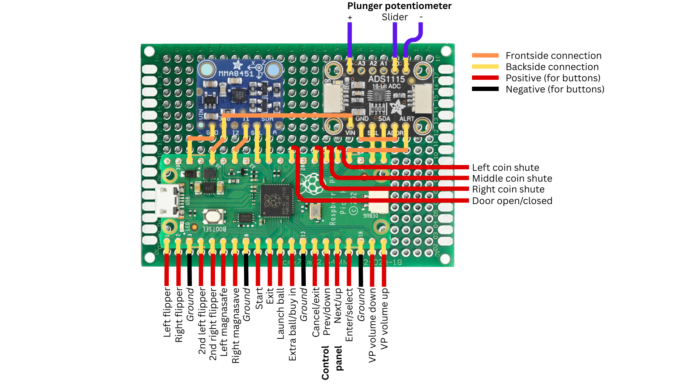
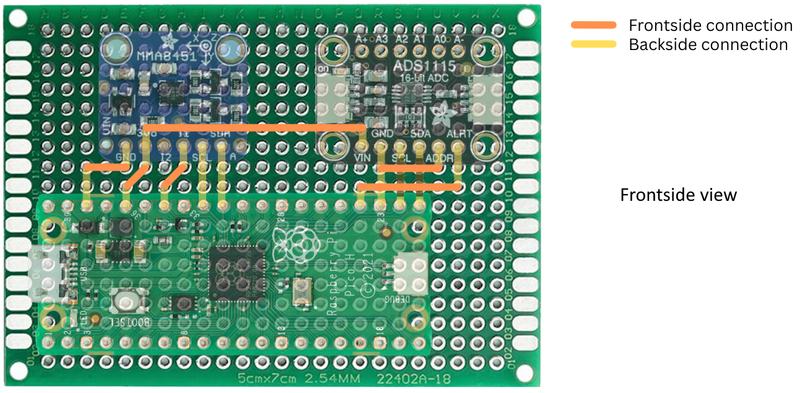
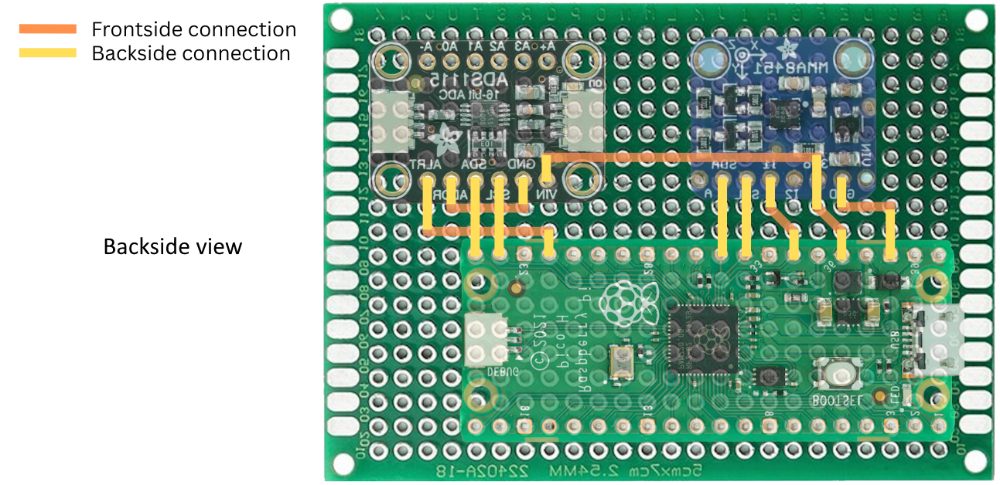
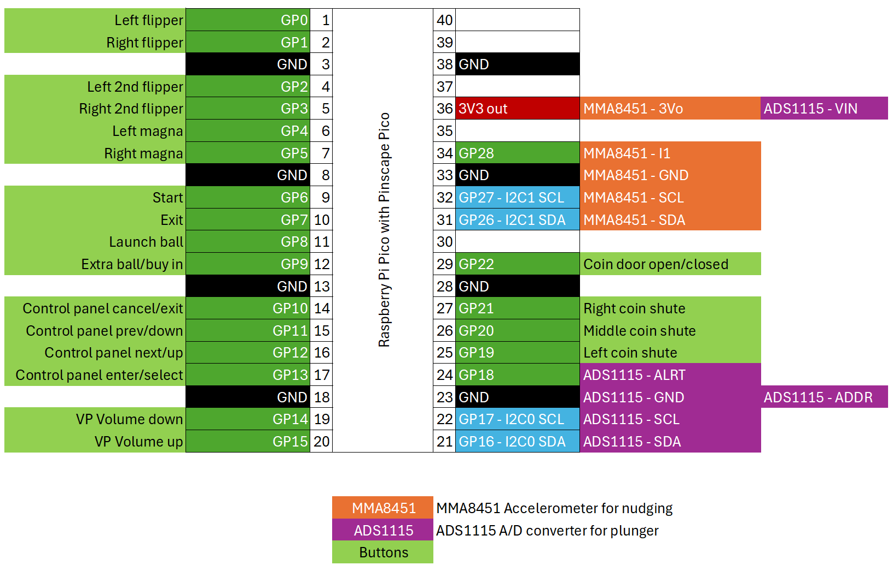

# How-to: basic Virtual Pinball setup with a Pinscape Pico

This page documents how to build a basic board that can be used in a Virtual Pinball cabinet that supports buttons, nudging and a plunger.

The board is based on the great work of Michael J Roberts aka MJR, who developed the [Pinscape Pico](https://github.com/mjrgh/PinscapePico/) I/O controller for pinball cabinets.

This project supports connecting almost all necessary pinball related buttons. It also supports nudging through the Adafruit MMA8451 breakout board and uses the Adafruit ADS1115 breakout board to connect an analog plunger with a potentiometer.

This project is meant as a basic Virtual Pinball setup without outputs. If you need outputs, this project might not be for you. 

## Materials and tools needed

Materials
- Raspberry Pi Pico H ([Raspberry Pi](https://www.raspberrypi.com/documentation/microcontrollers/pico-series.html#pico-1-family), [DigiKey](https://www.digikey.nl/nl/products/detail/raspberry-pi/SC0917/16608257))
- Adafruit MMA8451 Triple-Axis Accelerometer ([Adafruit #2019](https://www.adafruit.com/product/2019), [DigiKey](https://www.digikey.nl/nl/products/detail/adafruit-industries-llc/2019/4990790))
- Adafruit ADS1115 16-Bit ADC ([Adafruit #1085](https://www.adafruit.com/product/1085), [DigiKey](https://www.digikey.nl/nl/products/detail/adafruit-industries-llc/1085/5761229))
- Adafruit Universal Proto-Board PCBs 5cm x 7cm - 3 Pack ([Adafruit #4786](https://www.adafruit.com/product/4786), [DigiKey](https://www.digikey.nl/nl/products/detail/adafruit-industries-llc/4786/13617527))
- Analog plunger kit ([GermanGamingSupplies](https://germangamingsupplies.com/Analog-Plunger-Set), [Arnoz](https://shop.arnoz.com/en/19-plunger))
- Solder
- Preformed jumper wires
- Wire for connecting the buttons and plunger

Tools
- Soldering station
- Third hand soldering station (preferable)

## Creating the board

The image below shows the layout of the components on the Proto-board and the connections between them. 

The orange connections are made at the front of the board, _below_ the breakout boards. The yellow connections are made at the back of the board.

The backside view (a mirrored image) can be used as a reference when soldering on the back of the Proto-Board.

### Connecting the MMA8451 and ADS1115 to the Pico
1. Solder the included pin headers to the MMA8451 and the ADS1115
1. On the front of the Proto-Board: create the orange connections using the preformed jump wires. Use tape to keep them in place, turn around the board and bend the ends in the right direction (follow the yellow lines). Now turn around the board again and remove the tape. If all is ok, the jump wires should stay in place.
1. Place the Raspberry Pi Pico H, the MMA8451 and the ADS1115 on the board. Make sure the pins are in the right place, exactly like in the picture. Use tape to keep them in place and turn around the board again.
1. On the back of the Proto-Board: Bend the pins of the components that are connected in the right direction (follow the yellow lines).
1. Now solder the yellow connections. Make sure to create a solid connection from the components to the Proto-Board as well as a solid connection between the pins that need to be connected to each other.

### Connecting the plunger and buttons

1. Solder the three wires for the plunger (purple/yellow lines) as displayed in the image.
1. Solder the wires for the buttons as displayed in the image. Connect each button with one end to the corresponding pin of the Pinscape Pico (red/yellow lines). Use any ground pin to connect the other end of the button (black/yellow lines)

### Software configuration

1. Download the [latest Pinscape Pico release](https://github.com/mjrgh/PinscapePico/releases) and unzip it.
1. Start the GUIConfigTool, connect the Pico and install the latest firmware (it's included in the same directory).
1. Copy the text from [config.json](config.json) and paste it in the configuration tab of the GUIConfigTool (replacing the existing text).
1. Click the "Program Pico" button. The Pinscape Pico is rebooted with the new configuration. You can check the Buttons, Nudge and Plunger tabs to see if everything works correctly, tweak the nudge settings and calibrate the plunger.

You now should be all set to use the Pinscape Pico as a Virtual Pinball controller. 

## Background information

Below you will find the button and breakout board connections to the Raspberry Pi Pico / Pinscape Pico. The configuration in the [config.json](config.json) file is based on this layout. If you change something in the layout, the config file should be updated accordingly.
 

Note: at this time, the ADS1115 ALRT (alert) pin is connected to GP18. However, it is not currently configured to be used; it resulted in a lagging plunger.

## License
Copyright 2025, Marten Schukkink

Released under a [BSD 3-clause license - NO WARRANTY](license.txt)

## Credits and links

- A big shoutout to Michael J Roberts aka MJR for creating the original Pinscape, the [Pinscape Pico](https://github.com/mjrgh/PinscapePico/), the [PinballY frontend](http://mjrnet.org/pinscape/PinballY.php) and [The New Pinscape Build Guide](http://mjrnet.org/pinscape/BuildGuideV2/BuildGuide.php).
- Use and configuration of the MMA8451Q: [[1]](https://github.com/mjrgh/PinscapePico/blob/main/Guides/MMA8451Q-Setup.md) [[2]](http://mjrnet.org/pinscape/PinscapePico/Help/JSONConfigRef.htm#mma8451q)
- Use and configuration of the ADS1115: [[1]](https://github.com/mjrgh/PinscapePico/tree/main/ExpansionBoards/DIY-Friendly#ads1115-adc) [[2]](http://mjrnet.org/pinscape/PinscapePico/Help/JSONConfigRef.htm#ads1115)  [[3]](https://learn.adafruit.com/adafruit-4-channel-adc-breakouts)